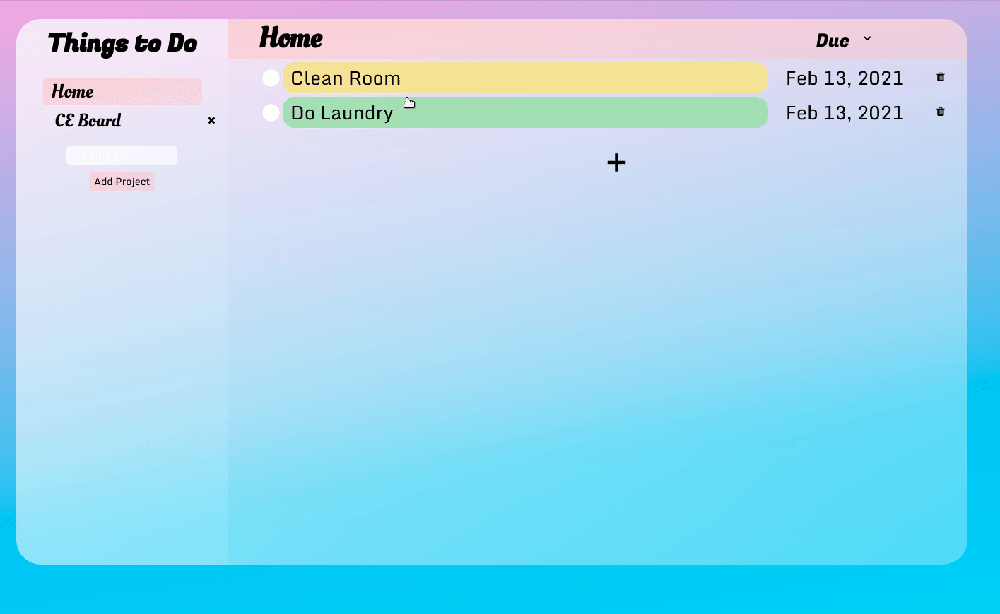

# To Do List Web Application using HTML, CSS, Javascript
https://nilryan.github.io/to-do-list/

## Learning Outcomes:
  1. Application of Array methods filter, find, map, sort 
  2. Array of objects storage in local storage browser using JSON
  3. CSS styling

### Personal Notes
  1. Try to apply SOLID principles more.
  2. Organize code in a cleaner way.
  3. Always reset css.

